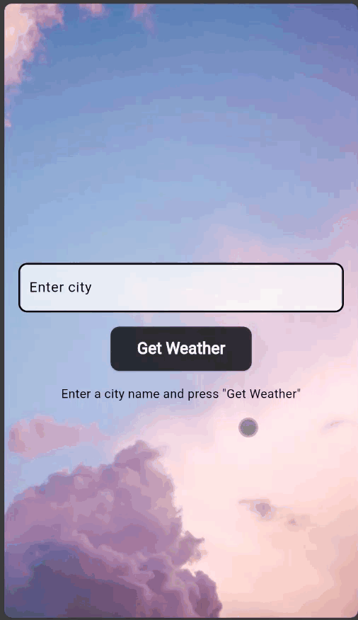

# [Weather App ☁]
The **Weather Flutter App** is a sleek and user-friendly mobile application that allows users to check the weather for any city. Users can enter the city name, and the app fetches real-time weather data such as temperature, description, and other relevant details. The app is designed with a modern interface, providing a clean, responsive experience, and displaying detailed weather information instantly.

## [GIF]

## [Features]

### City Search:
- Users can enter the name of any city to retrieve the current weather details.

### Real-Time Weather Data:
- The app fetches real-time weather information, including temperature, weather condition, and a brief description.

### Error Handling:
- Provides an intuitive error message when a city name is not found or an issue occurs while fetching the data.

### User-Friendly UI:
- Clean, responsive design with an intuitive layout, making it easy to navigate and retrieve weather data.
- Centralized styles file for consistent styling of UI elements.

### Loader Animation:
- A loading indicator appears while the app is fetching weather data, enhancing user experience during network requests.

### State Management:
- Efficient state management ensures smooth performance, tracking loading states, weather data, and error messages without data loss during interaction.

### Weather Display:
- Beautifully animated text transitions to enhance the presentation of weather data like temperature, city name, and description.

### Input Validation:
- Includes validation for the city input to prevent submission of empty fields or numerical input only.

## [Architecture]

The app follows the **MVC (Model-View-Controller)** architecture pattern, which separates the application logic into three interconnected components:

### Model:
- Contains the structure for weather data (e.g., `WeatherModel`).
- Handles business logic such as data fetching from the weather API via the `WeatherService`.

### View:
- Composed of the UI elements and screens (e.g., `WeatherInput`, `WeatherDisplay`).
- Responsible for presenting weather data to the user and capturing their input.

### Controller:
- Acts as an intermediary between the Model and View.
- Manages the flow of data and updates the View based on user input and API response.
- Handles user input, validates city names, and fetches weather data accordingly.

## [ Directory Structure ]

- **lib**
   - **controllers**
      - `weather_controller.dart` ==> Manages weather fetching logic and state management.
   - **models**
      - `weather_model.dart` ==> Defines the structure for weather data such as temperature, city name, and description.
   - **services**
      - `weather_service.dart` ==> Handles the API calls to fetch real-time weather data.
   - **utils**
      - `styles.dart` ==> Contains app styles and themes for consistent design.
   - **widgets**
      - `weather_input.dart` ==> Input field for the user to enter the city name.
      - `weather_display.dart` ==> Displays the fetched weather information (city, temperature, description) or error message.
   - **main.dart** ==> Entry point of the application.
   - **routes.dart** ==> Defines app routes if needed for future scalability.
